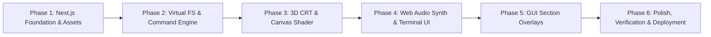

# Implementation Plan — Linux Terminal 3D Portfolio

## 1. Executive Summary & Vision

Transform Rithik Agrawal's developer portfolio into a **fully interactive, retro-futuristic 3D Linux Terminal experience**. 
Instead of a standard landing page, visitors arrive at a floating 3D CRT monitor in a dark atmospheric cosmos. The terminal is a living CLI with a custom command engine, virtual Unix filesystem (`/home/rithik`), interactive 3D CRT shaders (curvature, scanlines, bloom, chromatic aberration), authentic audio feedback (synthesized mechanical keypress clicks & boot chime), and seamless transitions into terminal-styled GUI showcase views.

### Confirmed Specifications
- **Framework:** Next.js 14+ (App Router, TypeScript, Tailwind CSS)
- **Primary Aesthetic & Default Theme:** **Amber CRT** (`#ffb000` phosphor on obsidian `#0a0800`), with on-the-fly theme switching (`matrix`, `cyber`, `dracula`).
- **3D Environment:** Three.js + React Three Fiber (`@react-three/fiber`, `@react-three/drei`, postprocessing) featuring a floating CRT monitor with screen curvature, scanline shaders, subtle mouse-reactive tilt, and ambient starfield.
- **Audio System:** Web Audio API procedural sound engine (no heavy audio files needed; instant load) for mechanical keyclicks, carriage returns, and hardware boot chime.
- **Resume Source:** Copied directly from `/Users/rithikagrawal/Development/Projects/agent/master_resume.pdf`.

---

## 2. Visual Architecture & Modes

```
┌───────────────────────────────────────────────────────────────────────┐
│                                                                       │
│         ╔═══════════════════════════════════════════════════╗         │
│         ║                                                   ║         │
│         ║  rithik@portfolio:~$ neofetch                     ║         │
│         ║                                                   ║         │
│         ║    ██████╗  ██╗████████╗██╗  ██╗██╗██╗  ██╗       ║         │
│         ║    ██╔══██╗ ██║╚══██╔══╝██║  ██║██║██║ ██╔╝       ║         │
│         ║    ██████╔╝ ██║   ██║   ███████║██║█████╔╝        ║         │
│         ║    ██╔══██╗ ██║   ██║   ██╔══██║██║██╔═██╗        ║         │
│         ║    ██║  ██║ ██║   ██║   ██║  ██║██║██║  ██╗       ║         │
│         ║    ╚═╝  ╚═╝ ╚═╝   ╚═╝   ╚═╝  ╚═╝╚═╝╚═╝  ╚═╝       ║         │
│         ║                                                   ║         │
│         ║    OS:        PortfolioOS v2.0                    ║         │
│         ║    Host:      Rithik Agrawal                      ║         │
│         ║    Role:      Full Stack Software Engineer        ║         │
│         ║    Uptime:    4+ years in production              ║         │
│         ║    Shell:     amber-bash 5.2                      ║         │
│         ║    Audio:     WebAudio Synth [ACTIVE]             ║         │
│         ║    Stack:     Python, Flask, Angular, Next.js     ║         │
│         ║    Scale:     15M+ Users (JioMeet), 30+ Countries ║         │
│         ║                                                   ║         │
│         ║  rithik@portfolio:~$ █                            ║         │
│         ║                                                   ║         │
│         ╚═══════════════════════════════════════════════════╝         │
│                          ┌──────────────┐                             │
│                          │ 3D CRT Base  │                             │
│                          └──────────────┘                             │
│               [ Ambient stars · Grid floor · CRT bloom ]              │
└───────────────────────────────────────────────────────────────────────┘
```

### Dual Interaction Paradigm
1. **Pure Terminal Mode:** 
   - Commands like `help`, `whoami`, `neofetch`, `ls`, `cat about.md`, `history`, `tree` print formatted ANSI colored text directly inside the monitor stream.
2. **GUI Extended Mode:**
   - Commands like `cd experience`, `cd projects`, or `gui` smoothly animate the 3D camera and reveal visual terminal-chrome cards (rich project grids, interactive timeline cards, live links) while keeping the CLI accessible via a persistent HUD prompt.

---

## 3. Virtual Filesystem Hierarchy

The portfolio data structure behaves like a genuine Unix filesystem:

```bash
/home/rithik/
├── .profile                  # Shell config & quick stats
├── about.md                  # Comprehensive bio & background
├── resume.pdf                # Master resume (downloadable & previewable)
├── experience/
│   ├── power-financial.md    # Full Stack Dev at Power Financial Wellness (30+ countries)
│   └── jio-platforms.md      # Team Lead at Jio Platforms (JioMeet 15M+ users)
├── projects/
│   ├── neural-commerce.md    # AI e-commerce platform
│   ├── datastream-pipeline.md# Real-time Kafka/Spark pipeline
│   ├── cloudorch.md          # K8s CI/CD orchestration suite
│   ├── sentiment-ai.md       # NLP transformer pipeline
│   ├── authvault.md          # Zero-trust biometric authentication
│   └── financeflow.md        # Personal finance ML dashboard
├── skills/
│   ├── languages.json        # Python, TypeScript, Go, JavaScript, SQL
│   ├── frameworks.json       # FastAPI, Flask, Angular, React, Next.js
│   ├── databases.json        # PostgreSQL, Redis, MongoDB, ClickHouse
│   ├── devops.json           # Docker, Kubernetes, AWS, Jenkins, CI/CD
│   └── architecture.json     # Microservices, REST APIs, TDD/BDD
├── contact/
│   ├── email.txt             # Direct email link & mailto trigger
│   ├── github.url            # https://github.com/rithikagrawal
│   ├── linkedin.url          # https://linkedin.com/in/rithik-agrawal
│   └── twitter.url           # https://twitter.com/rithik_agrawal_
└── .easter-eggs/
    ├── matrix.sh             # Digital rain animation
    ├── cowsay.sh             # ASCII talking cow
    ├── audio.sh              # Toggle click/hum sounds
    └── sudo.sh               # Easter egg elevator
```

---

## 4. Comprehensive Command Engine (40+ Commands)

| Category | Commands | Behavior |
|---|---|---|
| **Filesystem & Nav** | `ls`, `ls -la`, `cd <dir>`, `cd ..`, `cd ~`, `pwd`, `cat <file>`, `tree`, `find <term>`, `head <file>`, `grep <pattern>` | Traverses `/home/rithik/` with realistic error codes (`No such file or directory`, `Is a directory`) |
| **Identity & Stats** | `whoami`, `hostname`, `neofetch`, `fastfetch`, `uname -a`, `uptime`, `id`, `man rithik` | Outputs ASCII badge, system metrics, years in production, scale stats |
| **Shell Utilities** | `help`, `clear`, `history`, `echo <str>`, `date`, `wc <file>`, `alias`, `which <cmd>` | Standard bash command simulation with history stack and output formatting |
| **Actions & External**| `open resume`, `open github`, `open linkedin`, `open twitter`, `mail`, `curl <url>` | Launches modals, downloads, or external links safely |
| **Sound & Visuals** | `sound on/off`, `theme amber`, `theme matrix`, `theme cyber`, `theme dracula` | Live re-theming and audio synth toggle |
| **Easter Eggs** | `sudo hire-me`, `matrix`, `cowsay <msg>`, `fortune`, `sl`, `vim`, `nano`, `rm -rf /`, `exit` | Playful developer easter eggs, animated steam locomotive, permission denials |

### Shell Features:
- **Tab Auto-completion:** Autocompletes commands, directories, and file paths.
- **History Navigation:** `ArrowUp` and `ArrowDown` navigate command history buffer.
- **Control Shortcuts:** `Ctrl+L` to clear, `Ctrl+C` to cancel current line.
- **Dynamic Mobile HUD:** Tappable command chips for touch screens (`[help]`, `[neofetch]`, `[projects]`, `[experience]`, `[resume]`).

---

## 5. 3D CRT & Audio Engine Specs

### 3D Scene (`@react-three/fiber` & `@react-three/drei`)
- **CRT Monitor Mesh:** Procedural rounded-bezel monitor housing with curved face plate.
- **Procedural Screen Shader:**
  - Barrel distortion (convex glass curvature)
  - Horizontal phosphor scanlines with subtle flicker
  - Vignette darkening towards edges
  - Chromatic aberration (slight RGB offset at peripheral pixels)
  - Postprocessing Bloom pass for phosphor glow
- **Dynamic Camera & Floating Physics:**
  - Gentle idle float (`Math.sin` oscillation)
  - Interactive mouse parallax (monitor angles slightly toward cursor)
  - Smooth camera dolly zoom into the screen when typing or expanding GUI view

### Procedural Web Audio Engine
- **Keypress Synthesis:** Dual-frequency bandpassed noise bursts mimicking mechanical keyboard click + clack switch rebound (zero external audio files).
- **Enter/Carriage Return:** Satisfying low-frequency solenoid thud.
- **Boot Chime:** Multi-oscillator harmonic chord inspired by vintage terminal power-on.
- **Sound Toggle:** Accessible via icon in header or `sound on`/`sound off` command.

---

## 6. Color Themes

### 1. Amber Monochrome (Default)
- Primary Text: `#ffb000` (Amber Phosphor P3)
- Background: `#0a0800` (Deep CRT Obsidian)
- Accent/Highlight: `#ffd000`
- Dim / Borders: `rgba(255, 176, 0, 0.2)`
- Glow: `0 0 12px rgba(255, 176, 0, 0.5)`

### 2. Matrix Green
- Primary Text: `#00ff41`
- Background: `#050d06`
- Accent/Highlight: `#33ff66`
- Dim: `rgba(0, 255, 65, 0.2)`

### 3. Cyberpunk Cyan
- Primary Text: `#00d4ff`
- Background: `#080c14`
- Accent/Highlight: `#ff007f`
- Dim: `rgba(0, 212, 255, 0.2)`

### 4. Dracula
- Primary Text: `#f8f8f2`
- Background: `#1e1f29`
- Accent/Highlight: `#bd93f9`
- Dim: `rgba(189, 147, 249, 0.2)`

---

## 7. Execution Roadmap (Phased Plan)



### Phase 1: Project Setup & Migration Foundation
- Scaffold Next.js 14+ with App router, TypeScript, and Tailwind CSS.
- Port data models (`Experience`, `Project`, `Skill`, `SocialLink`) from existing Angular service into `/src/data/portfolio.ts`.
- Copy master resume from `/Users/rithikagrawal/Development/Projects/agent/master_resume.pdf` to `/public/master_resume.pdf`.
- Set up JetBrains Mono variable typography and theme CSS variable architecture.

### Phase 2: Virtual Filesystem & Command Engine
- Build recursive virtual filesystem tree with standard file attributes.
- Implement command parser (tokenizer, flags, quoted strings).
- Create 40+ command handlers with full help manuals and formatted tables.
- Implement tab-completion dictionary and command history stack.

### Phase 3: 3D CRT Monitor & Shader Environment
- Implement Three.js canvas with ambient space environment (stars, subtle perspective grid).
- Construct 3D CRT monitor geometry with stand, screen bezel, and glass mesh.
- Integrate CRT post-processing effects (barrel distortion, scanline overlay, bloom, RGB split).
- Project live interactive HTML terminal onto the 3D screen via `@react-three/drei` `<Html transform>`.

### Phase 4: Audio Engine & Interactive Shell
- Build procedural Web Audio API sound synthesizer for keyclicks, backspace, enter, and boot chime.
- Implement boot sequence animation simulating BIOS/kernel initialization.
- Construct responsive terminal prompt with live caret, ANSI color rendering, and auto-scroll.

### Phase 5: Terminal-Themed GUI Showcase Sections
- Create visual terminal-card views for projects, experience timeline, skills matrix, and contact form.
- Implement smooth camera transitions between terminal-focused view and expanded showcase mode.
- Add mobile bottom HUD with touch-friendly command quick-actions.

### Phase 6: Performance, Easter Eggs & Netlify Verification
- Add easter eggs (`matrix` canvas rain, `cowsay`, `sl` train, `sudo hire-me`).
- Test Lighthouse performance, ensure fallback for devices with reduced WebGL capabilities.
- Verify production build (`npm run build`) and deployment readiness.

---

## 8. Verification & Acceptance Criteria
- **Build Quality:** Zero TypeScript errors, zero lint warnings, fast Next.js production bundle.
- **Command Robustness:** All 40+ commands yield accurate output; invalid commands fail gracefully.
- **3D Performance:** Stable 60 FPS animation on desktop; graceful high-performance fallback on mobile.
- **Audio Authenticity:** Crisp mechanical clicks on keystroke without latency or audio clipping; toggleable with `sound off`.
- **Content Accuracy:** Accurate reflection of 4+ years experience, Jio Platforms (15M+ users), Power Financial Wellness, and verified projects.
